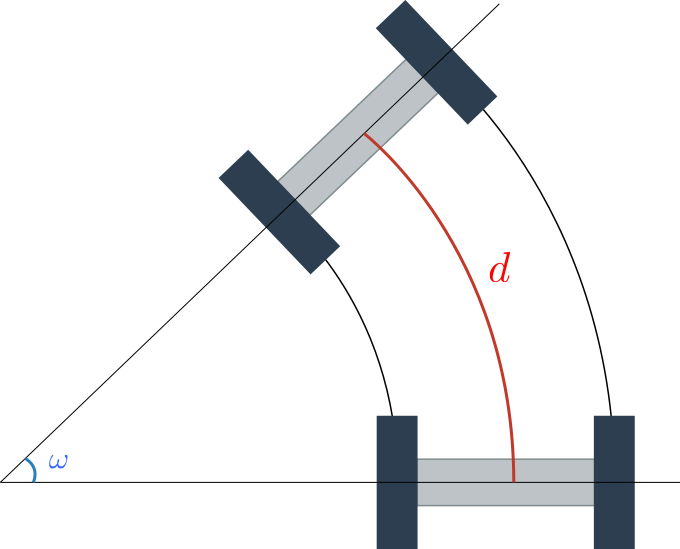
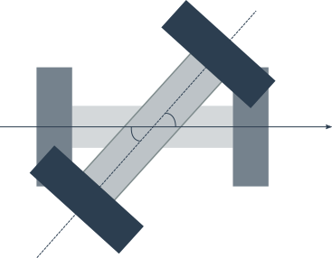

<!-- $theme: default -->

# オドメトリ手法
ETロボコン2022では、走行体の走行距離と自転角度を *オドメトリ手法* を用いて計算する。

*オドメトリ手法* とは、走行体の車輪に関する回転角度から、走行体の位置を推定する手法の総称である。

---

# 走行距離の計算

求める走行距離は、下図で赤く表記した $d$ である。
旋回角度( $\neq$ 自転角度)の $\omega$ も求められるが、今回は無視する。

---

# 走行距離の計算
距離 $d$ は、各車輪の移動距離 $d_L, d_R$ から求められる。
左車輪と右車輪、それぞれの回転角度を $x_L, x_R$ とし、下図のように車輪半径を $r$ とすると

---

# 走行距離の計算
左車輪と右車輪、それぞれの移動距離 $d_L, d_R$ は扇形の弧長だから

$$d_L = \frac{2\pi r}{360} x_L, \quad d_R = \frac{2\pi r}{360} x_R$$

で計算できる。

---

# 走行距離の計算

求めた $d_L, d_R$ を平均すると走行体の走行距離 $d$ を得る

$$d = \frac{1}{2}\left(d_L + d_R\right)$$

---

# 自転角度の計算
自転角度とは、走行体が車輪間の中心を軸として回転した際の回転角度である。
自転角度は、下図に示すように、左車輪と右車輪のいずれか一方から求めることができる。今回は、両輪から求めて平均をとる。

---

# 自転角度の計算
左車輪から自転角度 $\theta_L$ を求める。
扇形と中心角との関係から、走行体のトレッド幅を $T$ とすると

$$\begin{aligned}
\theta_L &= \dfrac{180}{T/2 \cdot \pi} \times d_L \\ \\
&= \dfrac{180}{T/2 \cdot \pi} \times \dfrac{\pi \cdot r}{180} \cdot x_L \\ \\
&= \dfrac{2r}{T} \cdot x_L
\end{aligned}$$

となる。同様にして $\theta_R$ も求めて、 $\theta$ を求める
$$\theta = \frac{1}{2}(\theta_L + \theta_R)$$
